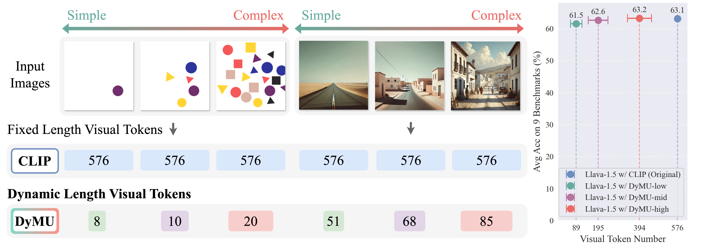

<!-- <p align="center">
  
</p> -->

<div align="center">
  <h1>DyMU: Dynamic Merging and Virtual Unmerging for Efficient VLMs</h1>
</div>

<p align="center">
<a href="https://mikewangwzhl.github.io/dymu/">🌐 Homepage</a>
•
<a href="https://arxiv.org/abs/2504.17040">🗃️ arXiv</a>
•
<a href="https://github.com/MikeWangWZHL/dymu/blob/main/static/pdf/dymu_apr23.pdf">📃 PDF </a>
•
<a href="https://github.com/MikeWangWZHL/dymu">💻 Code</a>
•
<a href="https://huggingface.co/mikewang/DyMU/tree/main" >🤗 Models</a>


<div align="center">
Zhenhailong Wang<sup>1*</sup>, Senthil Purushwalkam<sup>2*</sup>, Caiming Xiong<sup>2</sup>, 
Silvio Savarese<sup>2</sup>, Heng Ji<sup>1</sup>, Ran Xu<sup>2</sup>
</div>
<br>
<div align="center">
<sup>1</sup>University of Illinois Urbana-Champaign   <sup>2</sup>Salesforce Research
</div>
<div align="center">
<sup>*</sup>Equal Contribution
</div>
<br>

<p align="center">
  
</p>


## Installation

### Minimal setup
This allows using DyMU encoders to obtain dynamic length visual features.
```
pip install -e .
```

### VLM specific setup

1. install the llava/llava-one-vision package following:
    - if using llava-1.5
      ```
      conda create -n llava python=3.10 -y
      conda activate llava
      cd LLaVA
      pip install --upgrade pip
      pip install -e ".[train]"
      ```
    - if using llava-one-vision
      ```
      conda create -n llava_next python=3.10 -y
      conda activate llava_next
      cd LLaVA-NeXT
      pip install --upgrade pip
      pip install -e ".[train]"
      ```
2. Upgrade several pip modules for compatibility with open_clip:
    ```
    pip install --upgrade transformers accelerate sentencepiece deepspeed peft line-profiler
    pip install torch-scatter -f https://data.pyg.org/whl/torch-2.1.2+cu121.html
    pip install --upgrade timm ipdb
    ```

3. Install the custom open_clip
    ```
    cd .. # cd to the root of the repo
    pip install -e .
    ```

  
## Threshold Finding with DToMe
The threshold finding only requires inferencing on a set of images. A sufficiently large (e.g., 250K) and diverse dataset would be ideal. The thresholds will be stored as an avaraged statistic across all batches. The key function for doing DToMe can be found in `src/open_clip/tome.py` `batch_level_bipartite_soft_matching()`

- Preparing image dataset: prepare a JSON file with the following format:
  ```
    [
      {
        "image": "cat1.jpg" # relative path to the image in your image directory
      },
      {
        "image": "dog2.png"
      },
    ...
    ]
  ```

- Run threshold finding: please find the example script in:
  ```
    bash threshold_finding.sh
  ```


## Inference

Download DyMU encoder checkpoints with pre-computed from [here](https://huggingface.co/mikewang/DyMU/tree/main).
Or run threshold finding as described in [here](#threshold-finding-with-dtome).
Put the encoder checkpoints under `checkpoints/threshold_checkpoints`

### Dynamic length visual encoding usage examples
- DyMU with Siglip encoder example:
  ```
  python inference_siglip.py
  ```

- DyMU with OpenAI CLIP encoder example:
  ```
  python inference_openai_clip.py
  ```

### VLM inference with DyMU encoders

Make sure the VLM specific installation for the expected VLM is done as described [here](#vlm-specific-setup).

#### Llava-1.5:
  - Download pretrained llava-1.5 checkpoint, e.g., https://huggingface.co/liuhaotian/llava-v1.5-7b, and put it under `checkpoints/vlm_checkpoints`.
  - Modify the `mm_vision_tower` field in the `config.json` to  `ViT-L-14-336-tome-72out` for pointing the model to use DyMU vision tower. (72out here is only a template, one can use any thresholds during inference)
  - Run inference example:
    ```
    conda activate llava
    CUDA_VISIBLE_DEVICES=0 python LLaVA/inference_dymu_llava.py
    ```

#### Llava-One-Vision:
  - Download pretrained llava-ov checkpoint, e.g., https://huggingface.co/lmms-lab/llava-onevision-qwen2-7b-si, and put it under `checkpoints/vlm_checkpoints`.
  - Modify the `mm_vision_tower` field in the `config.json` to  `ViT-SO400M-14-SigLIP-384-tome` for pointing the model to use DyMU vision tower.
  - Run inference example:
    ```
    conda activate llava_next
    CUDA_VISIBLE_DEVICES=0 python LLaVA-NeXT/inference_dymu_llava_ov.py
    ```

### Implementation Notes

- In the paper, we demonstrate efficiency gains in terms of FLOPs using Virtual Token Unmerging (VTU) within Self-Attention blocks. However, in practice, we find that directly expanding Q and K to their full lengths and leveraging highly optimized sdpa or a single matmul function leads to shorter wall clock time. Therefore, we default to this faster, simpler implementation.
For completeness, we also provide an implementation that strictly follows the exact VTU attention decomposition, located in `LLaVA/llava/model/language_model/llava_llama_w_exact_vtu_attn.py`. This can be used as a direct drop-in replacement for `LLaVA/llava/model/language_model/llava_llama.py`. We encourage readers to explore further optimizations to reduce the wall clock time of the exact VTU attention.
Note: When using the exact VTU implementation, please explicitly set `attn_implementation` to `eager` when loading the model via from_pretrained.

- For LLaVA-One-Vision, the input to the encoder is a batch of image crops. In DyMU, since each crop may retain a variable number of tokens after each layer, sequence padding is required, which introduces additional computational overhead. We experimented with adding token packing via a custom Triton kernel, but it currently results in worse wall clock time. Thus we default to the with-padding version. We encourage further exploration of optimization strategies.

### Citation

```bibtex
@misc{wang2025dymudynamicmergingvirtual,
  title={DyMU: Dynamic Merging and Virtual Unmerging for Efficient VLMs}, 
  author={Zhenhailong Wang and Senthil Purushwalkam and Caiming Xiong and Silvio Savarese and Heng Ji and Ran Xu},
  year={2025},
  eprint={2504.17040},
  archivePrefix={arXiv},
  primaryClass={cs.CV},
  url={https://arxiv.org/abs/2504.17040}, 
}
```


### Acknowledgement
The codebase is based on amazing repos including: [open_clip](https://github.com/mlfoundations/open_clip.git), [llava](https://github.com/haotian-liu/LLaVA.git), [llava-next](https://github.com/LLaVA-VL/LLaVA-NeXT.git)

